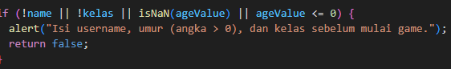
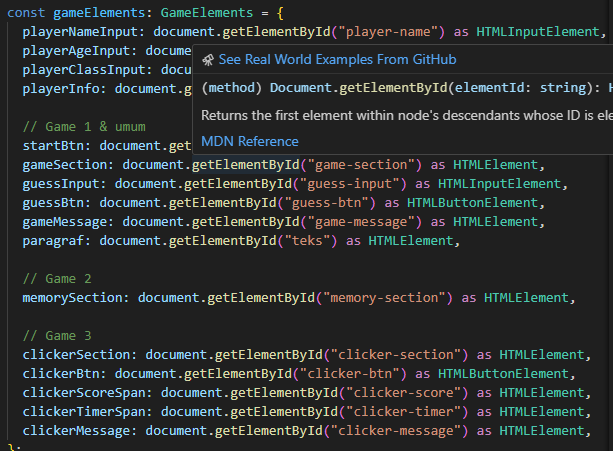
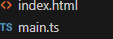

# GamesRevouFun

## overview

webiste permain anak sekolah. ada 3 jenis permainan anak sekolah,
sebelum permainan dimulai wajib mengisikan nama,umur dan kelas

## feature typescrip

interface & DOM: membungkus objek agar terstruktur & Mengambil id objek html ke typescript
fuction : memperitahkan code agar berjalan dengan baik,
null : nilai value nya kosong dan cek

1. Input player info > START
2. Game 1: Tebak angka > Benar > Auto next
3. Game 2: Match 4 pasang kartu > Selesai > Auto next
4. Game 3: Klik sebanyak mungkin 1000ms(1 detik) dan selesai
5. Skor terbaik tersimpan di LocalStorage.
   local storage : Nama pemain | nilai tertinggi

## Teknology use

1. HTML with Tailwind
2. typescript (js)

## deploy git action

link : https://revou-fsse-oct25.github.io/milestone-2-BudiArief2806/
